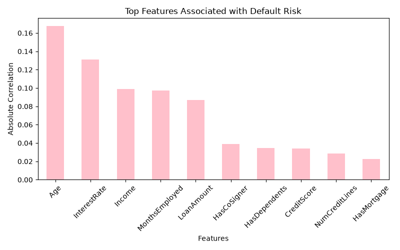
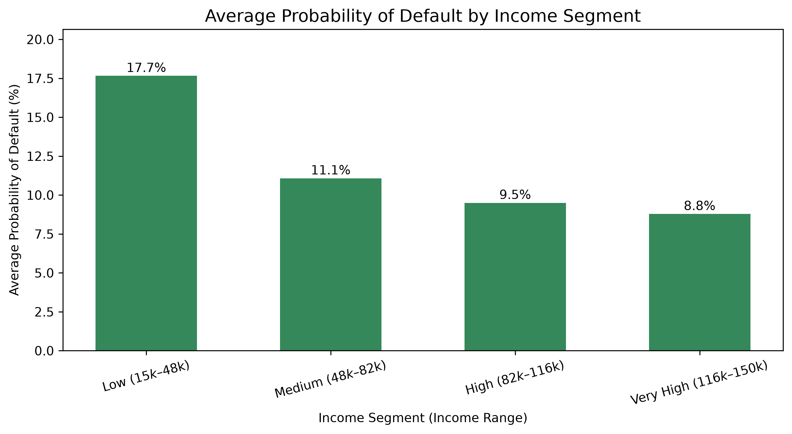
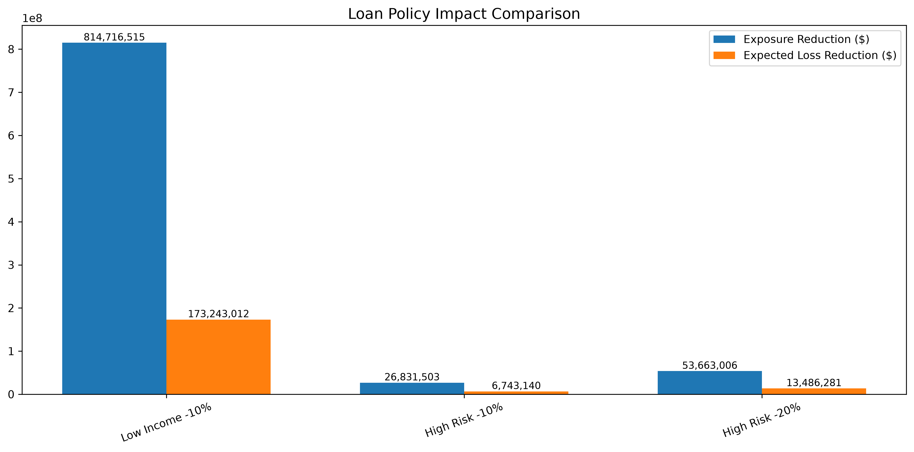
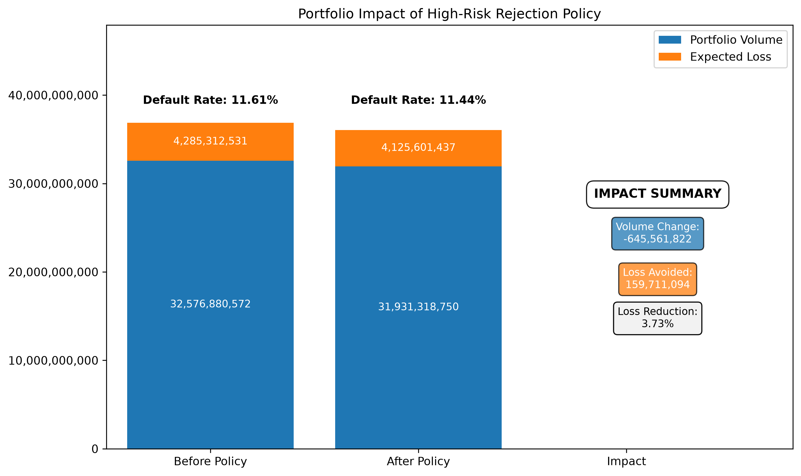

#  Credit Risk Portfolio Optimization & Policy Simulation

## Project Goal

To analyze key factors influencing loan default risk and build a predictive model to identify high-risk borrowers.

---

## Business Question

What is the potential financial impact of introducing loan size caps for low-income borrowers?

Specifically:

- How much larger are loans issued to defaulted borrowers?
- How much loan exposure is concentrated in low-income segments?
- How many dollars of high-risk lending could be avoided?
- Could reducing loan sizes improve portfolio quality without significantly reducing lending volume?

---

##  Dataset Description

This dataset contains borrower financial and personal attributes used to predict loan default.

## Data Quality Checks

Before analysis, the dataset was validated to ensure it is clean and reliable for modeling.

Key checks performed:

- Dataset structure: **255,347 rows × 18 columns**
- Missing values: **0 (no missing data)**
- Duplicate records: **0 (no duplicates found)**

- Numerical range validation confirmed all values are within expected limits:
  - Age: 18–69
  - Income: $15,000–$149,999
  - Loan Amount: $5,000–$249,999
  - Credit Score: 300–849
  - Loan Term: 12–60 months

- Binary categorical variables (`Yes/No`) were converted into numeric format (`0/1`) for analysis and modeling

- Data distributions were reviewed to ensure consistency and detect anomalies

Overall result:
- No missing values
- No duplicates
- No invalid or out-of-range records

📄 Full Data Quality Report: [Data Quality Report](reports/01_data_quality_report.md)

---

## Exploratory Data Analysis (EDA)

EDA was conducted to identify key drivers of loan default risk and understand borrower behavior.

Main analyses included:

- Correlation analysis between features and default:
  - strongest positive relationship: Interest Rate (**+0.131**)
  - strongest negative relationship: Age (**-0.168**)

- Default rate by employment type:
  - unemployed: **13.6%**
  - part-time/self-employed: **~11–12%**
  - full-time: **9.5%**

- Credit score analysis:
  - low score group: **~13.7% default rate**
  - high score group: **~9.8% default rate**
  - weak separation effect overall

- Income segmentation:
  - low income borrowers: **~22.5% default rate**
  - high income borrowers: **~8.8% default rate**
  - strong downward trend with increasing income

- Loan amount comparison:
  - defaulted borrowers: **$144,515 average**
  - non-defaulted borrowers: **$125,354 average**

- Overall default rate:
  - **11.61% (≈1 in 9 borrowers)**

- Group comparisons:
  - Defaulted borrowers tend to have lower income, higher loan amounts, and slightly lower credit scores

- Key risk drivers:
  - interest rate
  - income level
  - loan amount
  - employment stability

### Example Visualization

📄 Full EDA Report: [EDA Report](reports/02_eda_report.md)

---

## Predictive Model

To support lending decisions, a Logistic Regression model was developed to estimate the probability of borrower default.

The objective of the model was not only to classify borrowers as "good" or "bad", but also to evaluate how different lending policies affect **portfolio profitability and credit risk**.

### Portfolio Performance

| Metric                     |  Value |
| -------------------------- | -----: |
| Accuracy                   |  88.6% |
| ROC-AUC                    |  0.751 |
| Approval Rate              |    83% |
| Risk in Approved Portfolio |   7.8% |
| Portfolio ROI              |  2.55% |
| Test Portfolio Volume      | $6.53B |

A **ROC-AUC of 0.751** indicates good discriminatory power, meaning the model can reliably distinguish between lower-risk and higher-risk borrowers. While there is room for improvement, the model provides a solid foundation for portfolio-level decision making.

Using the selected approval policy, approximately **83% of applicants would be approved**, while reducing the expected default rate within the approved portfolio from **11.6% to approximately 7.8%**.

This demonstrates that predictive modeling can improve portfolio quality while maintaining a high approval rate.

### Profit Optimization

The model was evaluated under multiple approval thresholds to understand the trade-off between portfolio growth and credit risk.

| Threshold |  Profit |
| --------- | ------: |
| 0.2       | $166.4M |
| 0.3       | $122.6M |
| 0.4       |  $84.9M |
| 0.5       |  $57.0M |
| 0.6       |  $41.7M |
| 0.7       |  $31.6M |
| 0.8       |  $25.6M |

Lower approval thresholds generate higher portfolio profit by approving more borrowers, while stricter thresholds reduce both lending volume and profitability.

Under the assumptions used in this analysis, the **0.2 threshold produced the highest simulated portfolio profit of approximately $166M**.

Full Model Preparation Report: [Model_Preparation_Report](reports/03_model_preparation_report.md)

---

# Loan Size Policy Analysis

Although the predictive model improves borrower selection, an additional business question remained:

> **Can portfolio losses be reduced further by adjusting loan amounts for high-risk borrowers rather than only changing approval decisions?**

Before testing alternative lending policies, the portfolio structure was analyzed to determine which borrower characteristics drive default risk.

### Loan Term Analysis

Default rates remained remarkably stable across every loan term.

| Loan Term | Default Rate |
| --------- | -----------: |
| 12 months |       11.62% |
| 24 months |       11.61% |
| 36 months |       11.57% |
| 48 months |       11.57% |
| 60 months |       11.70% |

The proportion of defaulted borrowers was also almost identical across all maturities (approximately **20% of defaults in each loan term bucket**).

This indicates that **loan maturity itself is not a meaningful driver of default risk**. Simply offering shorter loan terms is therefore unlikely to materially improve portfolio performance.

Because loan term showed almost no relationship with default behavior, the analysis shifted toward evaluating **loan sizing policies**, particularly for financially vulnerable borrowers.

---

## Income and Default Risk

Borrowers were segmented by income level to understand how repayment risk changes across the portfolio.

| Income Segment | Default Rate | Avg Loan |
| -------------- | -----------: | -------: |
| Low            |       17.38% |  $127.6K |
| Medium         |       10.54% |  $127.7K |
| High           |        9.51% |  $127.3K |
| Very High      |        9.02% |  $127.6K |

Two important findings emerged:

* Default risk declines significantly as borrower income increases.
* Average loan amounts remain almost identical across all income groups.

This suggests that **higher-risk borrowers receive loans of similar size despite having substantially weaker repayment capacity**.

Based on these findings, the next step was to evaluate whether reducing loan amounts for higher-risk borrowers could improve portfolio quality.

---

# Strategy 1 — 10% Loan Size Reduction for Low-Income Borrowers

A policy simulation was performed in which loan amounts for low-income borrowers were reduced by **10%**.

| Metric                  |   Value |
| ----------------------- | ------: |
| Exposure Reduction      | $814.7M |
| Expected Loss Reduction | $173.2M |
| Efficiency              |   21.3% |

### Business Interpretation

Reducing loan sizes by 10% decreases total lending exposure by approximately **$815 million**, while reducing expected credit losses by approximately **$173 million**.

Every dollar removed from lending exposure generated approximately **21 cents of expected loss reduction**, demonstrating a measurable improvement in portfolio risk.

---

# Strategy 2 — Targeted High-Risk Borrower Policy

Rather than applying restrictions to all low-income borrowers, a second strategy focused only on borrowers meeting all of the following criteria:

* Low income
* Credit Score < 350
* Debt-to-Income Ratio > 0.60

This segment contains the highest concentration of credit risk.

| Metric             |   Value |
| ------------------ | ------: |
| Borrowers          |   2,109 |
| Portfolio Exposure | $268.3M |
| Default Rate       |  20.63% |

### Scenario A — 10% Loan Reduction

| Metric                  |  Value |
| ----------------------- | -----: |
| Exposure Reduction      | $26.8M |
| Expected Loss Reduction |  $6.7M |
| Efficiency              |  25.1% |

### Scenario B — 20% Loan Reduction

| Metric                  |  Value |
| ----------------------- | -----: |
| Exposure Reduction      | $53.7M |
| Expected Loss Reduction | $13.5M |
| Efficiency              |  25.1% |

### Business Interpretation

Targeting only the highest-risk borrowers produces **greater risk reduction per dollar of lending removed** than applying a broad policy across all low-income borrowers.

Although the total dollar impact is smaller because the segment itself is much smaller, capital is allocated more efficiently.

---

# Strategy Comparison

| Strategy                    | Exposure Reduction | Expected Loss Reduction | Efficiency |
| --------------------------- | -----------------: | ----------------------: | ---------: |
| Low-Income Borrowers (-10%) |            $814.7M |                 $173.2M |      21.3% |
| High-Risk Borrowers (-10%)  |             $26.8M |                   $6.7M |      25.1% |
| High-Risk Borrowers (-20%)  |             $53.7M |                  $13.5M |      25.1% |

The analysis shows a clear trade-off:

* Broad policies generate the largest reduction in portfolio losses.
* Targeted policies generate the highest risk reduction efficiency.

---

# Business Recommendations

Based on the analysis, the following lending policy is recommended:

* Reduce loan amounts by **10%** for low-income borrowers.
* Apply a **20% loan size reduction** for borrowers with low income, Credit Score below 350, and DTI above 0.60.

This combined approach is expected to:

* Reduce high-risk lending exposure by approximately **$868M**.
* Reduce expected credit losses by approximately **$179M**.
* Maintain a stable risk reduction efficiency of approximately **21–25%**.

---

# Final Business Conclusion

The predictive model demonstrates that borrower selection can substantially improve portfolio quality by reducing default risk among approved loans.

The policy simulations show that additional improvements can be achieved through **risk-based loan sizing**, rather than relying solely on approval decisions.

Overall, the analysis indicates that:

* **Borrower income is the strongest driver of default risk.**
* **Loan term has little influence on repayment outcomes.**
* **Risk-adjusted loan sizing can significantly reduce expected credit losses while preserving lending efficiency.**

Together, predictive modeling and risk-based lending policies provide a practical framework for improving both portfolio quality and financial performance.

Full Loan Size Strategy: [Loan Size Strategy](reports/04_loan_size_strategy_report.md)

---

# High-Risk Borrower Rejection Strategy (Policy Impact)

## Business Objective

This analysis evaluates whether rejecting a small group of extremely high-risk borrowers can improve portfolio quality and reduce expected credit losses while maintaining overall lending volume.

## Business Problem

Although the portfolio default rate is **11.61%**, a concentrated segment of borrowers exhibits significantly higher risk:

- Credit Score < 400  
- Income in bottom 25% of portfolio  
- Debt-to-Income Ratio > 55%  

The question is whether removing this segment improves portfolio performance without materially reducing lending activity.

## Rejection Policy

Borrowers are rejected only if all conditions are met:

| Risk Factor | Threshold |
|-------------|----------|
| Credit Score | < 400 |
| Income | Bottom 25% |
| Debt-to-Income Ratio | > 55% |

## Key Results

| Metric | Value |
|--------|------:|
| Rejected Applications | 5,071 |
| Lending Volume Removed | $645.6M |
| Expected Loss Avoided | $159.7M |
| Segment Default Rate | 20.19% |

## Portfolio Impact

| Metric | Before | After | Change |
|--------|--------|-------|--------|
| Portfolio Volume | $32.58B | $31.93B | -$645.6M |
| Default Rate | 11.61% | 11.44% | -0.17 pp |
| Expected Loss | $4.29B | $4.13B | -$159.7M |

## Business Interpretation

The reduction in default rate is small because the rejected group is a small portion of the total portfolio.

However, this segment contributes disproportionately to expected credit losses (~$160M).

Expected loss reduction is more meaningful than small changes in default rate.

## Risk–Return Trade-off

This policy removes:

- ~$646M in loan volume  
- 5,071 applications  

In exchange for:

- ~$160M reduction in expected losses  

## Recommendation

A targeted rejection policy for borrowers with:

- very low credit scores  
- low income  
- high debt-to-income ratio  

is recommended as a complement to predictive modeling.

Although default rate improvement is modest, expected loss reduction is material (~3.7%).