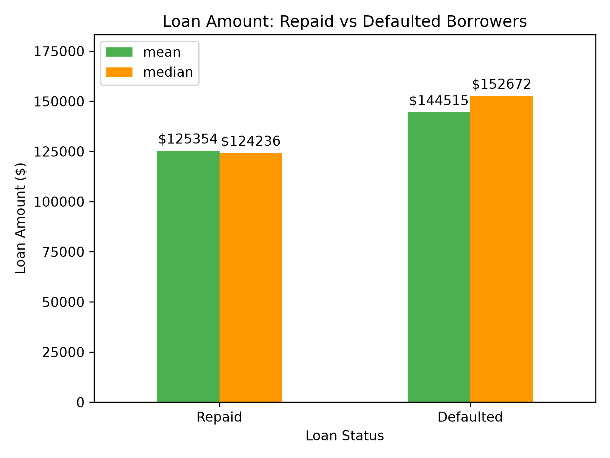
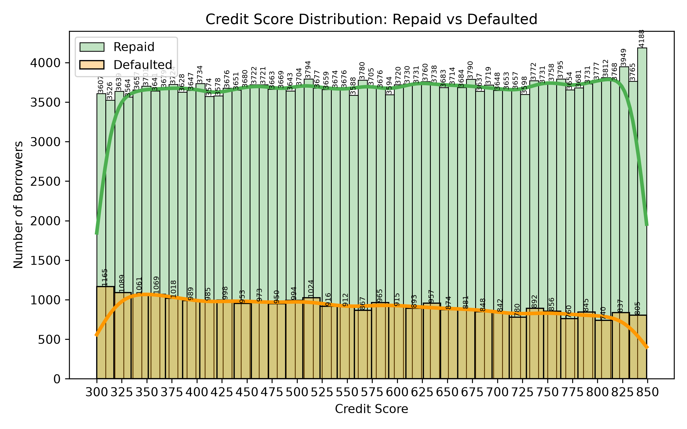
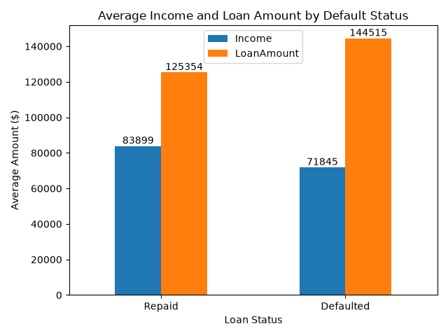
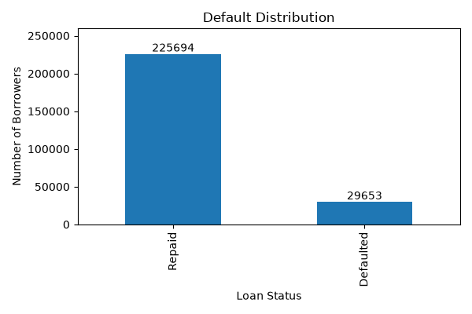
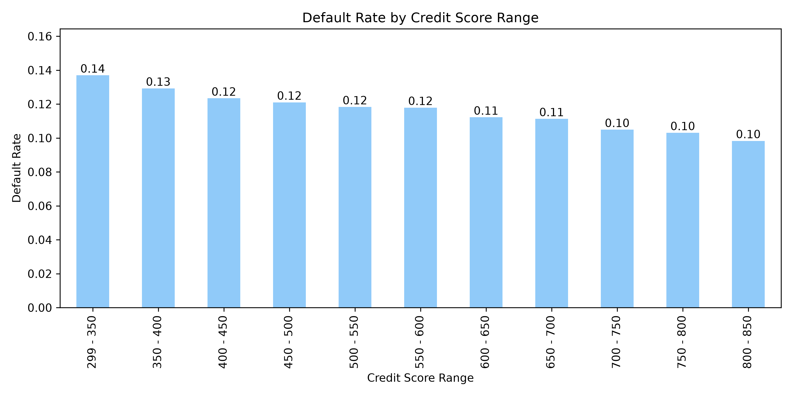
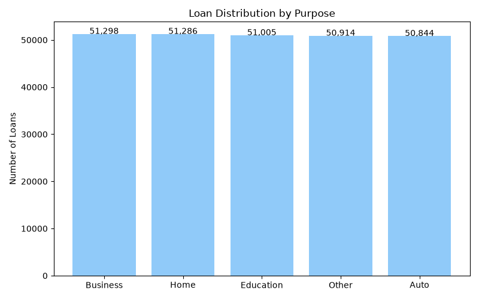
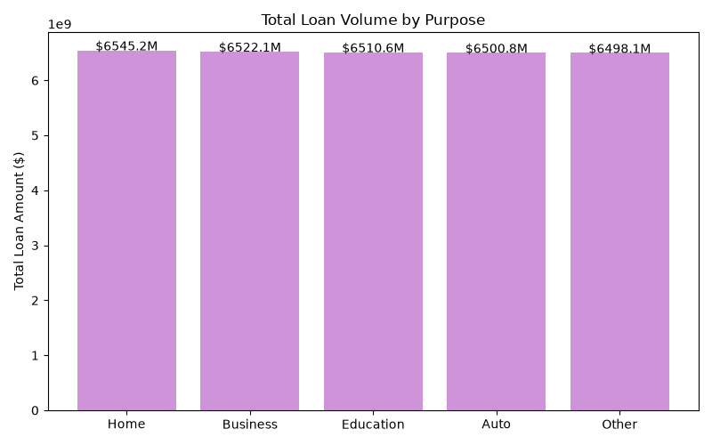
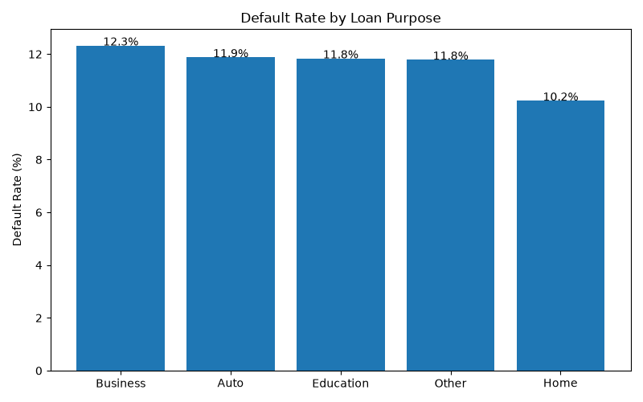
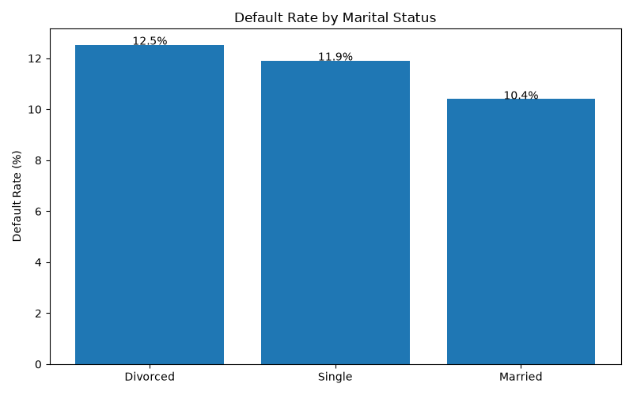
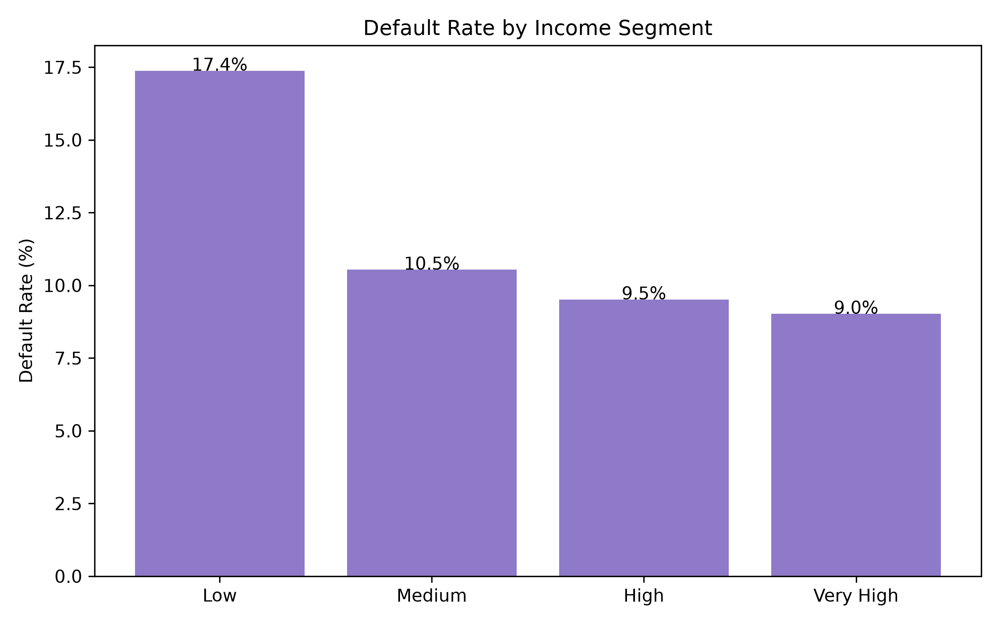

# Exploratory Data Analysis (EDA) Report: Credit Risk Factors

## Correlation Analysis

| Variable | Correlation with Default |
|----------|-------------------------:|
| Age | -0.168 |
| Income | -0.099 |
| Months Employed | -0.097 |
| Has Co-Signer | -0.039 |
| Has Dependents | -0.035 |
| Credit Score | -0.034 |
| Has Mortgage | -0.023 |
| Loan Term | 0.001 |
| DTI Ratio | 0.019 |
| Number of Credit Lines | 0.028 |
| Loan Amount | 0.087 |
| Interest Rate | 0.131 |

- Higher interest rates and larger loan amounts are associated with higher default rates.
- Older borrowers, higher-income borrowers, and borrowers with longer employment histories tend to default less frequently.
- Credit Score shows only a weak relationship with default in this dataset.

---

## Relative Importance of Risk Factors

The table below ranks variables by the strength of their relationship with default, regardless of direction.

| Variable | Absolute Correlation with Default |
|----------|----------------------------------:|
| Age | 0.168 |
| Interest Rate | 0.131 |
| Income | 0.099 |
| Months Employed | 0.097 |
| Loan Amount | 0.087 |
| Has Co-Signer | 0.039 |
| Has Dependents | 0.035 |
| Credit Score | 0.034 |
| Number of Credit Lines | 0.028 |
| Has Mortgage | 0.023 |
| DTI Ratio | 0.019 |
| Loan Term | 0.001 |

- Age and Interest Rate have the strongest associations with default among the variables analyzed.
- Income, employment history, and loan amount show a moderate relationship with borrower outcomes.
- No factor exhibits a strong standalone relationship with default risk.

---

## Default Rate by Employment Type

- Unemployed borrowers have the highest default rate (13.6%), indicating the greatest credit risk among employment groups.
- Full-time employees show the lowest default rate (9.5%), suggesting more stable repayment behavior.
- Part-time and self-employed borrowers fall between these two groups, with similar default rates of approximately 11–12%.

---

## Loan Amount Analysis

- Borrowers who defaulted received larger loans on average ($144,515) than borrowers who repaid their loans ($125,354).
- The median loan amount is also substantially higher among defaulted borrowers ($152,672 vs. $124,236).
- Loan amounts vary widely in both groups, ranging from approximately $5,000 to $250,000.
- The results suggest that larger loan balances are associated with higher default risk.

---

## Credit Score Analysis

- The credit score ranges of both groups overlap almost completely (both are mainly between ~300 and ~850), meaning defaulters and non-defaulters look very similar on this metric.
- The average credit score is slightly lower for defaulters (559 vs 576), but the difference is small and not meaningful in isolation.
- Median values show the same pattern, confirming that the typical borrower in both groups has a similar credit profile.

---

## Income and Loan Amount by Default Status

- Defaulted borrowers have lower average income ($71.8K) compared to repaid borrowers ($83.9K), indicating weaker financial capacity.
- At the same time, defaulted borrowers receive higher average loan amounts ($144.5K vs. $125.4K), suggesting higher leverage or risk exposure.
- This combination (lower income + higher loan size) increases repayment pressure and is associated with higher default risk.

---

## Default Distribution

- The portfolio contains 225,694 performing loans (88.39%) and 29,653 defaulted loans (11.61%).
- This corresponds to a default rate of approximately 1 in every 9 borrowers.
- A default rate around ~2–5% is considered low-risk, while values above ~10% indicate a noticeably riskier portfolio depending on product type and underwriting strategy.
- This level of default suggests moderate credit risk exposure and highlights the importance of strong risk-based pricing and borrower selection.

---

## Default Rate by Credit Score Range

- Borrowers with the lowest credit scores (≈300–350) have a default rate of ~13.7%, compared to ~9.8% for the highest score group (≈800–850).
- The difference between segments is relatively small, indicating that Credit Score alone does not strongly separate high-risk and low-risk borrowers.

---

## Group Comparison: Repaid vs Defaulted Borrowers

| Variable | Repaid | Defaulted | Difference (Defaulted - Repaid) |
|----------|--------:|----------:|--------------------------------:|
| Income | 83,899 | 71,845 | -12,054 |
| Loan Amount | 125,354 | 144,515 | +19,162 |
| Credit Score | 576 | 559 | -17 |

Default borrowers are characterized by a mismatch between income and loan size:
they earn less but borrow more, which increases repayment pressure.

---

## Key Drivers of Default Risk (Overall Impact)

- The strongest signals of default risk come from a combination of borrower age and pricing conditions (interest rate).
- Income and employment stability also play a meaningful role, reinforcing earlier findings that financial capacity reduces risk.
- Loan size appears less influential when compared to borrower profile and pricing factors.
- Overall, default risk is not driven by a single dominant variable, but by a combination of borrower characteristics and loan terms.

---

## Loan Purpose Distribution

| Loan Purpose | Number of Loans |
|--------------|----------------:|
| Business | 51,298 |
| Home | 51,286 |
| Education | 51,005 |
| Other | 50,914 |
| Auto | 50,844 |

- Loan distribution is highly balanced across all purposes (~50K each).
- Business and Home loans are slightly more frequent, but the difference is minimal.
- No strong concentration in any single loan category.

---

## Loan Volume by Purpose

| Loan Purpose | Total Loan Volume |
|--------------|------------------:|
| Home | 6,545,241,527 |
| Business | 6,522,120,439 |
| Education | 6,510,575,194 |
| Auto | 6,500,807,511 |
| Other | 6,498,135,901 |

- Loan volume is evenly distributed across all purposes (~6.5B each).
- Home loans generate the highest total exposure.
- Differences between categories are marginal (<1%).

---

## Default Rate by Loan Purpose

| Loan Purpose | Default Rate (%) |
|--------------|-----------------:|
| Business | 12.33 |
| Auto | 11.88 |
| Education | 11.84 |
| Other | 11.79 |
| Home | 10.23 |

- Business loans show the highest default risk (12.33%).
- Home loans have the lowest default rate (10.23%).
- Risk variation across purposes is moderate but consistent.

---

## Default Rate by Marital Status

| Marital Status | Default Rate (%) |
|----------------|-----------------:|
| Divorced | 12.53 |
| Single | 11.91 |
| Married | 10.40 |

- Divorced borrowers show the highest default rate.
- Married borrowers are the most stable group.
- Marital status shows a clear but moderate relationship with risk.

---

## Income Segment Analysis

| Income Segment | Borrowers | Avg Income | Avg Loan | Avg Credit Score | Default Rate (%) |
|----------------|----------:|-----------:|---------:|-----------------:|-----------------:|
| Low | 63,837 | 31,877.53 | 127,624.50 | 574.43 | 17.38 |
| Medium | 63,837 | 65,653.29 | 127,713.95 | 574.35 | 10.54 |
| High | 63,839 | 99,362.46 | 127,344.35 | 574.21 | 9.51 |
| Very High | 63,834 | 133,105.79 | 127,632.67 | 574.07 | 9.02 |

- Strong inverse relationship between income and default rate.
- Low-income borrowers default almost 2x more than high-income borrowers.
- Credit score remains relatively stable across income segments.

---