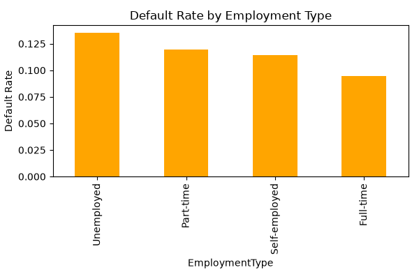

# Exploratory Data Analysis (EDA) Report: Credit Risk Factors

---

## Target Variable Analysis

| Loan Status | Share of Borrowers |
|------------|-------------------:|
| Repaid | 88.39% |
| Defaulted | 11.61% |

### Key Findings

- 88.4% of borrowers successfully repaid their loans, while 11.6% experienced default.
- The portfolio is dominated by performing loans, indicating an overall moderate-risk borrower population.

## Correlation Analysis

| Variable | Correlation with Default |
|----------|-------------------------:|
| Age | -0.168 |
| Income | -0.099 |
| Months Employed | -0.097 |
| Has Co-Signer | -0.039 |
| Has Dependents | -0.035 |
| Credit Score | -0.034 |
| Has Mortgage | -0.023 |
| Loan Term | 0.001 |
| DTI Ratio | 0.019 |
| Number of Credit Lines | 0.028 |
| Loan Amount | 0.087 |
| Interest Rate | 0.131 |

### Key Findings

- Higher interest rates and larger loan amounts are associated with higher default rates.
- Older borrowers, higher-income borrowers, and borrowers with longer employment histories tend to default less frequently.
- Credit Score shows only a weak relationship with default in this dataset.

## Relative Importance of Risk Factors

The table below ranks variables by the strength of their relationship with default, regardless of direction.

| Variable | Absolute Correlation with Default |
|----------|----------------------------------:|
| Age | 0.168 |
| Interest Rate | 0.131 |
| Income | 0.099 |
| Months Employed | 0.097 |
| Loan Amount | 0.087 |
| Has Co-Signer | 0.039 |
| Has Dependents | 0.035 |
| Credit Score | 0.034 |
| Number of Credit Lines | 0.028 |
| Has Mortgage | 0.023 |
| DTI Ratio | 0.019 |
| Loan Term | 0.001 |

### Key Findings

- Age and Interest Rate have the strongest associations with default among the variables analyzed.
- Income, employment history, and loan amount show a moderate relationship with borrower outcomes.
- No factor exhibits a strong standalone relationship with default risk.

---

## Default Rate by Employment Type

### Key Findings

- Unemployed borrowers have the highest default rate (13.6%), indicating the greatest credit risk among employment groups.
- Full-time employees show the lowest default rate (9.5%), suggesting more stable repayment behavior.
- Part-time and self-employed borrowers fall between these two groups, with similar default rates of approximately 11–12%.
